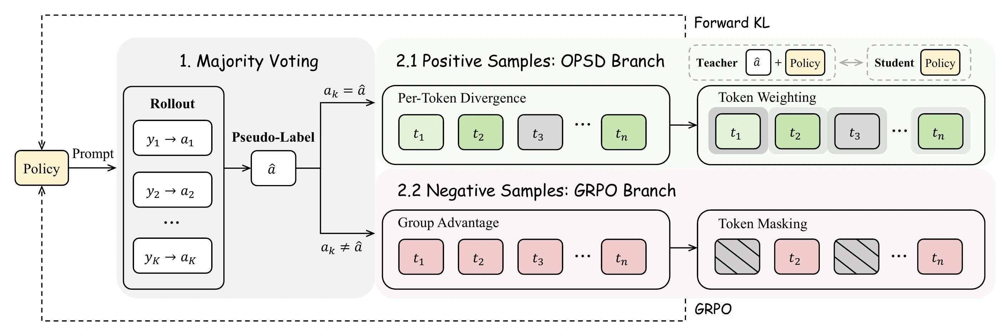

<h1 align="center">TTPO: Test-Time Policy Optimization</h1>

<p align="center">
  <a href="https://zju-real.github.io/TTPO/"></a>
  <a href="https://arxiv.org/abs/2608.27448"></a>
  <a href="https://huggingface.co/papers/2608.27448"></a>
</p>

<p align="center">
  <b>Aozhe Wang<sup>1,2,*</sup>, Zhengxi Lu<sup>1,*</sup>, Jianze Wang<sup>2</sup>, Shangke Lv<sup>1</sup>, Ying Liu<sup>2</sup>,<br>
  Weiming Lu<sup>1</sup>, Jun Xiao<sup>1</sup>, Yueting Zhuang<sup>1</sup>, Hua Yang<sup>2</sup>,
  Qianglong Chen<sup>2,†</sup>, Yongliang Shen<sup>1,†</sup></b>
</p>

<p align="center">
  <sup>1</sup>Zhejiang University &nbsp;&nbsp; <sup>2</sup>Alibaba Group<br>
  <sup>*</sup>Equal contribution &nbsp;&nbsp; <sup>†</sup>Corresponding authors
</p>

## 🔥 Overview

**Test-Time Policy Optimization (TTPO)** improves mathematical reasoning at test time without ground-truth labels. For each problem, TTPO samples multiple solutions and uses majority voting to route them into two complementary learning branches:

- Solutions that agree with the vote receive dense, token-level on-policy self-distillation.
- Solutions that disagree with the vote receive a conservative grouped RL penalty.
- Token weighting and masking focus learning on informative positions and reduce the impact of noisy pseudo-labels.

Trained without any labels, TTPO matches or exceeds label-supervised OPSD across Qwen3-1.7B/4B/8B on five competition-level benchmarks. In pure test-time training, it improves Qwen3-1.7B from **38.0 to 45.2 Avg@12**, outperforming both TTRL and self-distillation baselines. With thinking mode disabled, TTPO delivers gains of **+25.2 to +36.4 points** across model scales—several times those of label-supervised OPSD.

<p align="center">
  
</p>

## 📊 Results

All results are Avg@12. Methods marked with † use ground-truth labels during training; TTPO is label-free.

### 🧠 OpenThoughts Training

| Model | Method | AIME25 | HMMT25 | AIME26 | HMMT26 | BRUMO25 | Average |
|---|---|---:|---:|---:|---:|---:|---:|
| Qwen3-1.7B | Base | 36.9 | 21.9 | 37.8 | 28.8 | 47.5 | 34.6 |
|  | GRPO† | 37.3 | 23.6 | 40.3 | 29.3 | 48.1 | 35.7 |
|  | OPSD† | 40.3 | **28.1** | 46.4 | 31.4 | 52.5 | 39.7 |
|  | **TTPO** | **41.7** | 26.1 | **46.5** | **31.6** | **54.7** | **40.1** |
| Qwen3-4B | Base | 66.1 | 41.9 | 65.8 | 42.4 | 64.0 | 56.0 |
|  | GRPO† | 66.7 | **45.0** | 66.6 | 43.2 | 66.1 | 57.5 |
|  | OPSD† | 68.3 | 44.2 | **68.1** | 44.4 | **67.2** | 58.4 |
|  | **TTPO** | **69.4** | 43.6 | **68.1** | **44.7** | **67.2** | **58.6** |
| Qwen3-8B | Base | 66.7 | 44.2 | 67.5 | 45.5 | 69.2 | 58.6 |
|  | GRPO† | 70.3 | **46.7** | 69.2 | **48.0** | 71.9 | 61.2 |
|  | OPSD† | 70.8 | 46.4 | 72.5 | 47.2 | 71.4 | 61.7 |
|  | **TTPO** | **71.4** | 46.1 | **74.2** | **48.0** | **73.1** | **62.6** |

### ⏱️ Test-Time Training

Training is performed directly on unlabeled test problems; no method in this table uses ground-truth labels.

| Model | Method | AIME26 | HMMT26 | BRUMO25 | Average |
|---|---|---:|---:|---:|---:|
| Qwen3-1.7B | Base | 37.8 | 28.8 | 47.5 | 38.0 |
|  | TTRL | 39.2 | 30.6 | 50.9 | 40.2 |
|  | OPSD-TTT | 44.7 | 30.3 | 50.8 | 41.9 |
|  | **TTPO** | **48.9** | **33.6** | **53.1** | **45.2** |
| Qwen3-4B | Base | 65.8 | 42.4 | 64.0 | 57.4 |
|  | TTRL | 66.4 | 43.2 | 66.7 | 58.8 |
|  | OPSD-TTT | 67.8 | 43.4 | **66.9** | 59.4 |
|  | **TTPO** | **70.8** | **45.7** | **66.9** | **61.1** |
| Qwen3-8B | Base | 67.5 | 45.5 | 69.2 | 60.7 |
|  | TTRL | 70.8 | 48.0 | 70.1 | 63.0 |
|  | OPSD-TTT | 71.7 | 47.2 | 72.2 | 63.7 |
|  | **TTPO** | **73.9** | **48.5** | **73.6** | **65.3** |

### 💡 Non-Thinking Evaluation

After OpenThoughts training, TTPO improves the non-thinking average of Qwen3-1.7B, 4B, and 8B by **+25.2**, **+30.6**, and **+36.4** points, respectively.

| Model | Method | AIME25 | HMMT25 | AIME26 | HMMT26 | BRUMO25 | Average |
|---|---|---:|---:|---:|---:|---:|---:|
| Qwen3-1.7B | Base | 9.2 | 5.6 | 8.8 | 6.1 | 17.8 | 9.5 |
|  | OPSD† | 16.9 | 9.2 | 19.4 | 11.9 | 25.6 | 16.6 |
|  | **TTPO** | **39.2** | **20.6** | **39.8** | **26.3** | **47.5** | **34.7** |
| Qwen3-4B | Base | 22.2 | 12.5 | 19.4 | 17.2 | 28.3 | 19.9 |
|  | OPSD† | 26.7 | 18.9 | 24.4 | 22.5 | 36.1 | 25.7 |
|  | **TTPO** | **57.2** | **36.7** | **61.4** | **36.4** | **60.8** | **50.5** |
| Qwen3-8B | Base | 20.6 | 11.4 | 21.1 | 18.7 | 29.7 | 20.3 |
|  | OPSD† | 25.0 | 14.2 | 22.2 | 19.9 | 37.8 | 23.8 |
|  | **TTPO** | **67.8** | **42.5** | **65.0** | **41.2** | **67.2** | **56.7** |

See the [paper](https://arxiv.org/abs/2608.27448) for complete experiments and analysis.

## 🛠️ Installation

The provided environment uses Python 3.10, PyTorch 2.8.0, and vLLM 0.11.0.

```bash
git clone https://github.com/ZJU-REAL/TTPO.git
cd TTPO/TTPO

conda env create -f environment.yml
conda activate ttpo
pip install flash-attn==2.8.3 --no-build-isolation
```

## 🚀 Usage

The example recipes use four GPUs, LoRA, and colocated vLLM generation. Run the commands from the `TTPO/TTPO` directory.

### 🏋️ Training

```bash
# Qwen3-1.7B
bash scripts/run_ttpo_1b.sh

# Qwen3-4B
bash scripts/run_ttpo_4b.sh

# Qwen3-8B
bash scripts/run_ttpo_8b.sh
```

To train on another Hugging Face dataset, set `--dataset_name` in a launch script. TTPO requires a `train` split containing a `problem` field; `answer` is only needed for the ground-truth-routing ablation.

### 🧪 Evaluation

```bash
cd eval

python evaluate_math.py \
  --base_model Qwen/Qwen3-1.7B \
  --checkpoint_dir ../outputs/ttpo/qwen31b_ttpo_openthoughts/checkpoint-100 \
  --dataset aime26 \
  --val_n 12 \
  --temperature 1.0 \
  --tensor_parallel_size 4
```

Omit `--checkpoint_dir` to evaluate the base model. Add `--no_thinking` for non-thinking evaluation.

## ⭐ Citation

If you find TTPO useful, please cite:

```bibtex
@misc{wang2026ttpo,
  title   = {TTPO: Test-Time Policy Optimization},
  author  = {Wang, Aozhe and Lu, Zhengxi and Wang, Jianze and Lv, Shangke and
             Liu, Ying and Lu, Weiming and Xiao, Jun and Zhuang, Yueting and
             Yang, Hua and Chen, Qianglong and Shen, Yongliang},
  year    = {2026},
  eprint  = {2608.27448},
  archivePrefix = {arXiv},
  primaryClass  = {cs.CL},
  url     = {https://arxiv.org/abs/2608.27448}
}
```

## 🤝 Acknowledgements

This work builds upon [OPSD](https://github.com/siyan-zhao/OPSD) and [vLLM](https://github.com/vllm-project/vllm). We sincerely thank their authors and maintainers for their open-source contributions.
